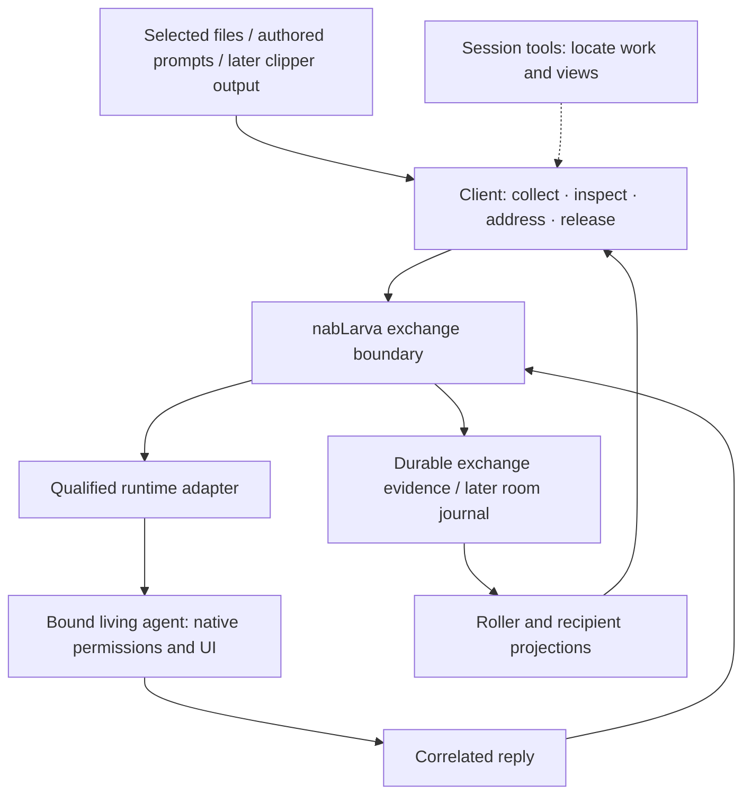

# nabLarva — working architecture and alternatives

*Cartan · 2026-09-29; premises reconciled 2026-10-04 · architecture proposal, not a lock or build authorization.
Revised after [Claude's independent challenge](review.claude.2026-09-29.md).*

The attached Flight seat's [second review](../_bus/00.flight-executioner.return.md)
is checked in [Cartan's cycle-00 verdict](../_bus/00.cartan.verdict.md); its supported
corrections and bounded proposals are incorporated below.

**Candidate for challenge, 2026-09-29.** The
[workflow comparison](workflow-reading.2026-09-29.md) covers sessions 01/02 and the
onion observation plan. Majkee's clarified priority is a durable file-based bus
that removes routine human carriage, with human decisions at meaningful boundaries
and sessions from different vendors able to use their own specialist agents.
Cartan is synthesizing that candidate; Flight is the independent challenger under
POINT 02. Further reading targets questions that could change the choice, rather
than requiring the whole historical collection to be consumed first. No direction
below is newly locked and no automatic runtime loop has been enabled.

## 1. The proposal

**Current premises — L13/L14, folded from X0 POINT 03 on 2026-10-04.**
[flag.md](../../flag.md) names the broker/CLI **stridulatrix**, the observation lab
**termpanum**, and the phone organ **stridularium**. PTY is the base layer for relay;
files remain the spine. Vendor-specific doors are replaceable weather, not the
foundation. The first-build plan is termpanum plus the PTY plan, with research before
build: `relay-00-research` → `relay-01-pty` · `relay-02-tracker` (D4). D7 requires blind
triangulation before a relay-architecture lock. D3's vocabulary remains docket 8.

The phone is a thin lens: sessions/processes live on the host; detach does not close
a bed; the app sends commands/prompts and receives output through the host engine.
Device reach stays inside the app and its files, with the scoped vault later (D5/D6).
See the current [six-design registry](../../../../meshup/REGISTRY.md) and the
[phone wrapper](../../AGENTS.stridularium-design.md) for detail and unresolved UI choices.
This section's small-core boundary remains a candidate within those constraints.

nabLarva should own the continuity of an exchange: who addressed whom, what was
released, what delivery evidence exists, which reply belongs to it, and what still
needs attention. Its clients may be shell commands, a terminal panel, an editor or
a phone. Choosing a GUI is independent of giving the application those boundaries.

The first useful experience is simple: **collect a prompt, choose a living colleague,
release it, see the reply beside it, continue**. The recipient acts in its own session
under its own permissions. Majkee can inspect the inter-session roller without
becoming the routine courier. Visible pending work and honest uncertainty matter
more than an impressive dashboard.

| Shape | What it gives | Cost and decision |
|---|---|---|
| Continue as shell bricks only | Fast, familiar, already delivered through ia-sync | Adequate for independent tools; weak once several tools must share exchange state, recovery and compatibility. Keep for current instruments. |
| Small app core + explicit adapters + thin clients | One owner for durable exchange behavior; CLI first; reusable tools remain independent | Recommended direction. Earn it with one pair and one workflow, then grow. Logical boundaries need not mean many packages or processes. |
| Full cockpit / agent framework now | A broad visual and automation surface | Defer: carrier qualification and the first complete loop remain unresolved. Too many capabilities would be designed before they can be exercised. |

“Application” here means an explicit command boundary, owned durable records,
known lifecycle and recoverable operations. A new tree of empty folders proves none
of these. A first implementation can be one executable and a few modules.

### Working contract for Flight to challenge

The proposed animal is a **bounded exchange loop between independent living
sessions**, with durable files carrying selected work and replaceable adapters
handling the qualified PTY impulse under L3/L4 and L14 D1/D2. Native hooks/records
may enrich observation; their availability cannot decide whether the PTY base exists.
“Hardcoded attractor” means explicit routing, correlation,
limits and stop conditions outside model prose. It does not mean hardcoding the
agents' conclusions or forcing agreement.

1. Majkee starts a bounded task with named peers, allowed work and a completion
   condition. Those peers may be different vendors; responsibility is assigned by
   the task, not permanently attached to a vendor.
2. A sender publishes the selected assignment and exact expected reply destination.
   The exchange mechanism checks that it belongs to this task and recipient before
   requesting activation through a qualified adapter.
3. The recipient reads and works in its own native session and permission context.
   It may use permitted specialists from its runtime's roster; it remains responsible
   for their work and the outward reply. Helpers need not become bus participants.
4. A complete, correlated reply becomes available to the designated next peer.
   Its qualified activation/read completes the transport loop. The peer reviews the
   work and may publish the next permitted assignment; receipt and acceptance remain
   different facts.
5. The cycle continues only within its declared scope and finite limits, or finishes
   on its completion condition. A budget or round limit stops an unproductive loop;
   it cannot prove semantic agreement. Exact limit values remain to be chosen for
   the first trial. No unsolicited peer discovery, automatic retargeting or blind retry.

The initial engineering slice retains the existing POINT/RETURN/VERDICT ownership
and one outstanding assignment per bound recipient from design r1. This description
creates no new `_bus/` kind or second acceptance ledger. A general room follows L3's
single-writer journal; mapping task artifacts into that room is a separate boundary.
Broader automatic continuation is a candidate beyond bed 02's operator-triggered
qualification, not a reinterpretation of its authorization.

| Event | Proposed human role |
|---|---|
| In-scope assignment, correlated reply, ordinary review/revision within the delegated task | Inspect when useful; no human copying or approval merely to relay each message. |
| Native permission request or action outside granted scope | Decide through the proper approval surface; the bus preserves the pending exchange. |
| Ambiguous target, uncertain delivery, missing/invalid reply or exhausted loop limit | Receive one actionable attention item with the evidence and available recovery choices; no silent fallback. |
| Product choice, unresolved tradeoff, architectural lock, promotion or deployment beyond existing authority | Decide at the relevant boundary, with the peers' disagreement and evidence visible. |
| Task completion within delegated scope | Receive the result; perform final acceptance where that task requires it, without reopening each intermediate relay. |

Files provide inspectable continuity; they do not wake agents, prove consumption,
or confer write permissions. Runtime changes therefore remain a maintenance concern
at the adapter boundary. A failed capability check must disable that automatic route
and expose the gap. The core must not repair it by interpreting terminal paint.
Different brands provide an opportunity for different perspectives, not a guarantee
of independent judgment; challengers must be free to reject the framing itself.

Flight should attack three assumptions in particular: whether this candidate
really removes human carriage end to end; whether its proposed policy can bound
repeated revisions without moving decisions into the transport; and whether the
adapter maintenance cost defeats the benefit. A smaller alternative that meets
the stated workflow is preferable to retaining this design for its own sake.

### How more historical material enters

Use the existing comparison as the working inventory: observed need, applicable
constraint, candidate mechanism, and evidence that would defeat it. Open additional
documents when they answer a named uncertainty or supply a counterexample. Retain
the source pointer and disposition; do not merge every historical proposal into a
growing feature list. High-value next inputs would change the required approval
boundary, peer lifetime, delivery semantics, or recovery behaviour. An exhaustive
archive synthesis is not a prerequisite for this candidate.

The former sentence “The onion observer is optional test support” is superseded
by L14 D1's termpanum-first plan. [Termpanum's lab design](../../../../meshup/lab.observability-probes.2026-08-01/DESIGN.md)
owns the observation questions; [relay research](../../../../meshup/seam.cross-vendor-relay.2026-08-05/DESIGN.md)
must produce the D4 verdict before build. Session 03 consumes that verdict for the
first prompt/reply slice; it does not infer ADOPT from X0's earlier suggestion or
open a live trial. The exact first fixture and vocabulary remain research/docket-8 work.

Session 03 still proposes final code/config/data/runtime homes and integration
boundaries. `toolbox/termpanum/` and `stridularium/{android,host}` are proposed homes,
not paths locked by L13's naming decision. Stridulatrix's lifecycle and journal store
remain docket 4 and 5. Relay-00-research owns the research verdict, not those product
placement decisions; Flight's independent challenge remains pending under POINT 02.

## 2. What the July notebook contributes

Three original photos are preserved with a [reading and provenance receipt](reading.notebook-2026-07-30.md).
The repository's July 31 seed already synthesized six pages; this pass checks only
the three received photos. They are older input, not a new ruling.

The strongest distinction is **whole conversation available to the human; selected,
addressed context released to an agent**. The sheets explicitly name a roller,
buffer, composer, recipient-specific options and release/submit. Thus collection,
selection and release are separate actions. A terminal observation is not yet a
message; a drafted message has not been sent; a visible transcript is a projection.

This does not restore cooperative anchors as regulation or Git as transport, both
rejected by L4. Nor does it move the compressor/composer into nabLarva: L8 keeps that
mechanism in applications-in-common. A future boundary note must define how OUTPUT(A)
becomes an admitted message. Start with a hand-authored prompt file; no compressor is
needed to prove the first exchange.

The preserved [k0k0nV3R idea](../../../../meshup/stridularium.mobile-console.2026-09-29/raw/IDEA.k0k0nV3R.2026-09-29.md)
describes a mobile collect/arrange/release tray, now an input to stridularium under
L13/L14. Its console/rendered-cards tension remains open; it supplies no second
message authority and is not a prerequisite for the first pair.

## 3. Where the responsibilities meet



The diagram shows responsibilities, not a queue service or a chosen storage schema.
For a task exchange, existing POINT/RETURN/VERDICT files keep their authority. A
future room has L3's single-writer journal as its truth. Joining them requires an
explicit import/reference rule; neither store silently becomes a second authority.

| Boundary | Owns | Must not acquire by accident |
|---|---|---|
| Exchange core | Addressing, correlation, release record, delivery uncertainty and replay/recovery rules | Provider credentials, session internals, authority to approve the recipient's work |
| Runtime adapter | Exact endpoint binding, qualified activation, acknowledgement evidence | Unqualified fallback paste, retargeting by a matching label, bypassing native approvals |
| Client / roller | Collection, selected release, display and attention | Authoritative delivery state or the lifetime of viewed agents |
| Reusable toolbox | Its bounded product contract | A mandatory dependence on the animal for standalone use |
| Development harness | RUNBOOK, STATUS, review/gavel and promotion procedure | Mandatory paperwork for every eventual end-user conversation |

**Ordinary messages and engineering assignments are related but different.** Today's
test can use POINT/RETURN because those already exist. The eventual product should
also carry “please read this and reply” without demanding a RUNBOOK, VERDICT and
STATUS. Its minimum common semantics are sender, recipient binding, selected content,
exchange correlation and delivery evidence. Exact envelope fields remain a design
question; do not start a second bus vocabulary during this study.

Convergence, Cartan and the project harness maintain the product; they are not
runtime roles every installation must reproduce. A file claim or presence mark is
also not a permission granted to a message recipient.

**Recipient proposal:** Majkee should also be addressable as the intended recipient
of a question, answer or attention request, with an explicit human delivery route.
The notebook supports this alongside the roller view. Showing a notice to Majkee
does not establish that he read it, nor that an agent sender was notified. Human
carriage is a supported intermediate route with a visible cost; it does not satisfy
the separate promise of automatic delivery back to that agent.

## 4. Current bricks, verified from source

Snapshot: nablarva `2244d23`, ia-sync `5eec5d7`, plus concurrent dirty work, inspected
2026-09-29 on office. These are source observations, not a blanket live-deployment
certificate. Read each task's STATUS for its current gate.

| Existing piece | Observed contract | Architectural implication |
|---|---|---|
| [session/base.zsh](/home/hruzam/ia-sync/zsh/session/base.zsh) | Explicit sources, define-only shell entry; generic session instruments, rescoped out of nablarva | Shell startup must not start the exchange loop or migrate application data. |
| [runbook.py](/home/hruzam/ia-sync/zsh/session/runbook.py) | Browses tasks and manages advisory board/UI state; optional sibling import of ovitmugen | There is already code coupling, not just aliases. Extract a shared interface when another consumer needs it; do not make the browser the relay brain. |
| [ovitmugen.py](/home/hruzam/ia-sync/zsh/session/ovitmugen.py) | Terminal frames/views, `ls --json`, protected agent panes | Reuse navigation; a pane/process is not evidence of readiness to receive input. |
| [Muticula brief](../../muticula-01-qualify/raw/muticula.master.2026-09-26.md) | Cooperative claims and adopted commit paths, enforcement under qualification | Coordinates authorship workflow; does not prevent arbitrary edits or isolate builds. |
| [Termbrana README](../../../../toolbox/termbrana/README.md) | Standalone Zellij observation product; M0 probe, core and persistence not yet built | Preserve library independence. Rendered text is not raw PTY evidence; no whole-app language inference from its Rust crate. |

The [zsh/nablarva scope](/home/hruzam/ia-sync/zsh/nablarva/base.zsh) already exists:
both authored [office config](/home/hruzam/ia-sync/zsh/config.office.zsh:159) and
[home config](/home/hruzam/ia-sync/zsh/config.home.zsh:131) source it. Office's live
config carries the hook, and all three scope files match source byte-for-byte
(Cartan verification after Flight's review, 2026-09-29). Home's live files and actual
command invocation were not checked. Its engine still points at `session/` and the
retired devenv sync/deploy pair, contradicting L12 and `.dev/session/`. Reconcile the
existing scope when that work is assigned; no new scope or repair is created here.

## 5. Source tree: one owner per behavior

Current generic instruments remain authored in ia-sync. Experimental animal behavior
is built in the authorized nablarva task bed under L6. Promotion to the surgical table
is reviewed; a successful reply is not a release approval.

**Phase 0, when its live gate is opened:** a new animal-only experiment can use an
explicitly owned foreground command in its authorized task bed. No new installer,
PATH launcher, service or XDG directory is required for the pair proof. This does not
relocate the accepted browser extension or rewrite its A/B/C sequence: existing work
keeps its declared source and owner. The native-carrier qualification owner controls
which process and endpoint may be started. Preserve released material and unresolved
attempts before stopping and pruning experimental files. This session starts nothing.

**Candidate graduation model, needing Majkee's decision:** application source stays
in nablarva, and a reviewed, pinned release plus host integration is delivered through
ia-sync. This interprets the surgical table as the promotion/install boundary without
creating two editable copies of the same app. Reconcile that interpretation with L6's
“structural builds stay on the surgical table” before adopting it. An alternative is
to promote source ownership to ia-sync; if selected, document the move and stop editing
the former source. Neither model is silently decided by this proposal.

Illustrative future tree — create a path only with the implementation that earns it:

```text
nablarva/
  src/                 # exchange behavior, CLI and runtime adapters; flat initially
  tests/               # real fixtures and behavioral checks
  packaging/           # release/install assets, when there is an installable program
  toolbox/termbrana/   # existing independently usable library/product
  docs/                # approved product and operator contracts
  .germline/           # development role contracts
  .dev/session/        # bounded development work, prunable after preservation
```

These are possible source homes, not a package/language decision. Do not create one
directory per biological name. A toolbox belongs with the source that actually owns
it; being mentioned in the animal's wrapper does not move its code into this tree.
Existing tools keep their own gates and delivery ownership.

## 6. Post-pair release design: files, configuration and data

An installation should answer “which code, whose settings, whose history, which
running instance?” without needing this checkout or an agent's private history.
The [XDG Base Directory specification](https://specifications.freedesktop.org/basedir/latest/)
separates configuration, user data, persistent state, cache and login-scoped runtime
files. The assignments below are proposals, not additional requirements of that spec.

| Material | Candidate home | Ownership / retention |
|---|---|---|
| Program and launcher | Versioned installed artifact; launcher on PATH | Installer owns code. Packaging layout and command name remain open; never resolve a release through a changing development checkout. |
| Portable defaults and integration recipe | Reviewed ia-sync source | Git versions intent; it does not prove a host activated it. |
| Effective settings | `$XDG_CONFIG_HOME/nablarva/` | Operator settings; host paths/bindings remain host-specific. No credentials in source. |
| Valuable conversation/exchange history | `$XDG_DATA_HOME/nablarva/` | User-owned; survives task pruning, client closure and program removal. Room single-writer/privacy rules apply when rooms exist. |
| Local attachments, recovery metadata, UI preferences | `$XDG_STATE_HOME/nablarva/` | Persistent host state; distinguish recoverable delivery evidence from disposable view preferences. |
| Sockets and process locks | `$XDG_RUNTIME_DIR/nablarva/` | Private, local and temporary. Losing this directory must not erase the only evidence of a submitted exchange. |
| Rebuildable indexes/previews | `$XDG_CACHE_HOME/nablarva/` | Safe to rebuild; never the sole message copy. |

**Historical variance:** the [July room proposal](../../../../raw.nablarva/oraculum-basic-triangulation/01_ARCHITECTURE_ROOM_AND_BROKER.md)
put rooms under `XDG_STATE_HOME`. L3 locks neutral ground, not that exact directory.
Using DATA_HOME for valuable retained conversations is a proposal requiring an
explicit retention/backup decision. Do not create or migrate a room store yet.
Installed code and volatile sockets must never be mistaken for the history backup.

Task artifacts can remain in their project beds, as the current protocol requires.
Before a general roller depends on them, decide whether it retains an immutable
released copy or a durable preserved reference. A pointer into a pruned task directory
is not durable history. Likewise, editing the original prompt after release must not
silently change the record of what the recipient was sent.

## 7. Post-pair release design: delivery, installation, wiring and activation

The current route is documented compactly in the [wrapper](../../AGENTS.PROJECT-DESIGN.md#volatile).
Verified source: [SYNC_DISCIPLINE](/home/hruzam/ia-sync/SYNC_DISCIPLINE.md),
[deploy.sh](/home/hruzam/ia-sync/deploy.sh),
[install-pkgs/run.sh](/home/hruzam/ia-sync/install-pkgs/run.sh).

| Step | Current precedent | Requirement for an app release |
|---|---|---|
| Author and verify | ia-sync compose-first; nablarva experimental bed | One authoritative source and a tested revision; no live-copy authoring. |
| Review/promote | Existing repository gates and [publish-gate work](/home/hruzam/ia-sync/.dev/session/publish-gate-00-design/STATUS.md) | Reuse the review boundary; do not invent another publishing protocol here. |
| Deliver files | `bash ~/ia-sync/deploy.sh --dry-run`, then authorized deploy; additive `rsync -a` ([flags](/home/hruzam/ia-sync/deploy.sh:34)) | Know the selected release and installed files. Copying alone neither activates nor removes obsolete files. |
| Host integration | `install-pkgs` is a separate, explicit second leg | Declare prerequisites, source revision, owned destinations and reload needs; apply only the intended reviewed recipe. |
| Wire client | Host config → existing nablarva/base.zsh → definitions; generic instruments use session/ | Reconcile the existing animal scope and its dead verbs before extending it. Session tools remain optional consumers. Source stays define-only. |
| Activate | Present tools run when invoked | Explicit owner starts the exchange mechanism; service versus foreground remains docket 4. |
| Verify use | Per-task observed checks | Verify installed revision, actual trigger and one harmless operation separately. An install receipt alone proves none of these. |

`install-pkgs` records per-host recipe version/time in
`~/.local/state/ia-sync/installed.json`; `update` runs eligible automatic tasks,
not a selected nablarva-only task. It offers no standard uninstall, app-data migration
or rollback transaction. `unmark` only forgets a receipt. Even `list` initializes
missing state, so this study inspected source rather than executing it as a read-only
probe. A future app recipe can reuse this activation seam without pretending the
runner is an application supervisor. No recipe is added by this study.

Recommended first recipe posture: manual activation until automated installation is
explicitly adopted. Host selection alone does not prevent an eligible automatic task
from running during a routine `update`. Keep the recipe's declared effects bounded.
Manual recipes are not inert: eligible new/stale tasks run their `check` block before
the manual/automatic branch. Require that future preflight to be read-only. Already
current or ahead-of-source tasks are skipped earlier; this is not a health check of
every installed task on each `update`.

The experimental-zsh [removal procedure](/home/hruzam/ia-sync/zsh/experimental/README.md)
already exposes the consequence of additive deployment: source removal needs an
explicit live cleanup. For the app, keep an owned-file inventory and a bounded removal
operation; do not introduce `rsync --delete` across the shared zsh tree.

## 8. Post-pair release design: administration, recovery and retirement

Administration is an operator interface, not automatically a root service. Before a
release, make these operations explicit; names below describe capabilities, not CLI
names being reserved:

- **Inspect:** code/config versions, data locations, exact bound endpoints, adapter
  capabilities, current process owner and unresolved attempts. A diagnostic should
  inspect without creating install state or contacting unrelated sessions.
- **Start/stop:** declare whether the process is an explicit foreground command or a
  managed service. Stopping a client detaches its view; it does not kill independent
  agents. Stopping the exchange mechanism reports unfinished submissions honestly.
- **Recover/rebind:** read durable evidence first; reconcile an interrupted submission
  before retry. A restarted session with the same visible name is a new binding.
- **Upgrade:** preflight data compatibility, retain a known code revision, and declare
  migration ownership. Reverting code is safe only while its data format is readable;
  do not promise automatic rollback of irreversible migrations.
- **Remove:** stop only owned processes, unregister owned hooks/client wiring, remove
  owned code. Preserve user history by default; history deletion is a separate action.

For the first pair, explicit foreground operation may be enough. Do not build a
scheduler, background retry service, admin database or cross-host installer until a
measured workflow needs it. The required discipline is known ownership and recovery,
not a large control plane.

## 9. First slice and decisions that remain open

**Ordering after L14:** the product success criteria below survive, but choosing
and implementing the first automated slice now depends on the relay-00-research
verdict (D4) and the existing native-carrier qualification. The browser exercise is
an observation candidate, not permission to bypass that sequence. No research gate
has been opened or declared passed by this architecture fold.

**Candidate slice 0 — make returns visible to Majkee, using the existing browser.**
The baseline's one recorded exchange attributes five actions to outward carriage,
approximately nineteen actions plus four waits to the return leg, and sixteen minutes
to notice lag. Those are the head's segmentation of one mixed workflow, not proof
that a new watcher would remove all that effort. They justify measuring return and
attention costs early, without reopening the accepted A/B/C sequence.

The [runbook browser](/home/hruzam/ia-sync/zsh/session/runbook.py:687) already groups bus
files by cycle and highlights RETURN presence without a VERDICT file. Its selected-bed
view refreshes when file metadata changes. First exercise that existing view and its
navigation with a manually carried exchange; propose additional code only for the
remaining measured gap. An invoked or visible view does not notify an absent operator.
Any later proactive notice must declare an actual delivery surface and be tested.

Presence, complete publication, correlation, human notice and acceptance remain
different observations. The current display intentionally claims file presence only;
it does not infer acknowledgement from filenames. Before a stronger notice, define
how a reply is published completely and matched to the exact released POINT. Approval
waits need their own reliable signal; terminal text may be a display hint, never proof
of readiness or delivery. No scanner, watcher or notification service is built here.

The fuller exchange analysis below supplies identities and acceptance conditions.
The first slice uses one host, one human, two explicitly bound living sessions, an
authored file and one correlated reply. It needs no GUI, compressor or general room
service. It is complete only when the selected outward and return routes work and
attention/approval reaches the operator. A manual return is a useful intermediate
result but leaves the product loop incomplete.

**Product success:** a fixed released prompt reaches the bound recipient, a reply
correlates to that prompt, and the sender receives the return notice and can read
it. The selected content remains inspectable after both turns. Engineering review
through VERDICT and STATUS is an outer task workflow, not a requirement for every
message. The existing POINT/RETURN shapes and `cycle`/`return_to` may carry the test
without becoming compulsory end-user paperwork.

For the experimental pair, propose write-once released prompt artifacts and correlated
replies, retaining the current protocol's exact destinations. Before that bed is
pruned, its owner names the durable preservation destination and verifies the copies
and references. This study creates no message store. The longer-term choice of retained
copies versus preserved references is a product decision, not silently delegated to
the cleanup script.

Measure total operator carriage and recovery against the existing manual baseline;
do not equate fewer keystrokes on send with a complete workflow. Exercise interrupted
delivery, a replaced endpoint and late/partial replies. The pipe-qualification bed
owns native experiments; this architecture gate does not open its live sitting.

Before implementation beyond that qualified slice, Majkee needs a small set of
decisions, supported by this study rather than many new forms:

1. Adopt the small-core direction, revise it, or continue with independent bricks.
2. Choose the source/promotion model at L6's boundary; pin what an installation means.
3. Set retained-message ownership and room storage/backup semantics, preserving L3;
   name the first pair's preservation destination before its bed can be pruned.
4. Resolve the relevant existing docket entries: language, lifecycle, store
   and v1 cut only as the selected build needs them. Names are settled by L13;
   UI/IDE choice can remain open.

The proposed operator-recipient role and early return/attention exercise belong in
Majkee's review of the blueprint. They are candidates, not new locks or a change to
bed 02's live qualification gate.

Reuse check: current task protocol, session browser, Ovitmugen views and ia-sync
delivery each already solve a portion. No evidence yet earns replacing them with a
new framework. Any proposal to adopt an external framework needs its own current,
bounded evaluation before a dependency is selected; none is selected here.

## 10. Exchange evidence and the engineering wrapper

This condenses the wrapper's former §2.2, retaining its source reconciliation.
Majkee selected sequential prompts/replies between independent living sessions.
Sequential means exchange order, not that the sender must block inside a tool call.

### Product loop, with optional engineering review

```mermaid
flowchart LR
    P["Released prompt file"] --> B["Exact endpoint binding"]
    B --> A["Qualified wake: recipient reads prompt"]
    A --> W["Living recipient processes prompt"]
    W --> R["Correlated reply file"]
    R --> N["Qualified wake: sender reads reply"]
    N -. "engineering assignment only" .-> V["Head reviews: VERDICT"]
    V --> S["Owner updates STATUS; majkee gavels if needed"]
```



The accepted first-brick design (preserved at
`28847e8f8c703166a018123b0bdfd6808c69f99d:.dev/session/nablarva-01-design/raw/design.r1.md`;
read with `git show` from the repository root) has
three increments: A prepares/copies from the browser; B qualifies outward native
activation and a correlated RETURN; C would qualify the return wake. That accepted
sequence and each task's ownership remain intact. Today's
[pipe qualification](../../nablarva-02-pipe-qualification/STATUS.md) has not opened
its live sitting. Neither this diagram nor the Claude consultation proves a carrier.

Prepared, submitted, consumed, reply present, work accepted and task STATUS advanced
are separate facts. Acknowledgement does not prove consumption; a file appearing
proves neither acceptance nor safe activation of its reviewer. The current B scope
still needs human return discovery/review. Qualifying Codex input alone cannot wake
a Claude sender. Explicit manual carriage is a measurable intermediate gap, never a
claim of two-way delivery. Keep native UI accessible for attention and approval.

The older [Costa seed](../../../../raw.nablarva/grounded-composites/costa.seed.codex-claude-composite.2026-08-07.md)
suggests a bounded waiting tool that returns the colleague's reply. It remains an
optional alternative with its own timeout/cancellation/continuity tests. None of its
Git-as-wire or pane-injection proposals returns through that option.

**Existing consultation carriers, clarified through Flight's POINT-01 review:**
[fresh relay and continuity tunnel](tunnel-consultation.2026-09-29.md) serve different
needs. A planner's fresh opinion uses the existing Vega/Mirror route through
`codex-run.zsh`; a follow-up needing earlier conversation uses the stored-thread
tunnel. Both return through the waiting call without a separate reverse wake.
Fresh context alone does not prove independent judgment, and the relay's writable
sandbox/retry behavior differs from the tunnel's default read-only context. The
tunnel also has no interactive approval surface. Neither carrier establishes delivery
into an already-running interactive Codex seat. Keep consultation separate from the
**living-peer exchange** gate. The linked note distinguishes send/read historical
proof from later ask code and records version, input, timeout and recovery limits.
No invocation, upgrade or new implementation is authorized by this classification.

### Identity and ownership

Keep distinct: **bed** (task evidence); **seat** (role); **runtime session and
incarnation** (participant); **exchange/cycle and return_to** (correlation);
**tmux server and IDs** (view); **board attachment** (advisory presence);
**Muticula team ID/key** (its authorized operations); **source revision** (observed
or released material). A matching label does not prove the other relationships.
Join them explicitly when needed; the first pair needs no universal registry.
Credentials stay with their owners, outside prompts, observations and the roller.

The [Braid and Book study](../../../../raw.nablarva/nabla-buffer-brideAndBook/braid-and-book.substrate.2026-08-01.md)
adds a useful context rule: retain who proposed, observed and authorized a statement.
The [entity study](../../../../raw.nablarva/symetry.claude.ai.claude-fable-5/blind-traingulation.chatgpt-asymmetry-sol.entity/triangulation.entity.round-two.2026-08-04.md)
keeps purpose and provenance across changed runtime sessions, while requiring measured
value before middleware. Reattachment must reconcile unresolved attempts before a new
assignment; borrowed labels cannot stand in for continuity.

### Relation to rooms and observations

L3 still gives a room one append-only journal and participant projections. Existing
task files retain their current authority. A later room may reference preserved
exchange artifacts, but retention/import/replay requires an explicit room design.
Native attachment in the accepted task slice does not amend the room's adapter-owned
PTY decision; an actual integration conflict returns to Majkee with evidence.

The [relay-seam fold](../../nablarva-02-pipe-qualification/raw/fold.relay-seam-v2.2026-09-13.md)
already separates notification from acceptance. Later
[Wave](../../relay-contract/meeting.wave-nabla-majkee.2026-09-16/relay-contract.by-wave.md) /
[Nabla](../../relay-contract/meeting.wave-nabla-majkee.2026-09-16/relay-contract.by-nabla.md)
drafts distinguish failed work, invalid assumptions and delivery timeout. Their
automatic re-wake, advancement and `send-keys` ideas conflict with current fences and
remain proposals. No retry follows an unknown submission without reconciliation.

[Termbrana's scope](../../toolbox-termbrana-01-brief/brief.md), its
[context/provenance proposal](../../toolbox-termbrana-01-brief/raw/03_identity_and_termbrana_2026-09-25.md)
and the [Ommatermia brief](../../toolbox-ommatermia-00-brief/raw/brief-substrate-for-RUNBOOK.ommatermia.2026-09-04.md)
provide observation/selection possibilities. An observation is not release or delivery;
a sensor cannot decide task acceptance. L14 now supplies the termpanum-first build
plan; the research verdict determines the necessary sensing in the first pair.

### Observable proof

Use the [manual baseline](../../nablarva-02-pipe-qualification/raw/baseline.md)
for the whole exchange, including binding, attention, return discovery and recovery.
It is one recorded human workflow, not a general performance benchmark. A faster
outward send cannot establish that Majkee stopped being the routine courier.

Before a live slice, its owner declares exact targets, selected material, correlation,
return path and the allowed activation mode. Exercise a normal reply, an approval
need, a replaced endpoint, interrupted submission and a late/partial reply. Each
uncertain case preserves evidence without retargeting or repeating work. Product
success requires both wake directions in the selected mode; engineering acceptance
and STATUS advancement stay with the task's reviewer/owner. If a carrier fails,
retain explicit file carriage and report the remaining gap.
