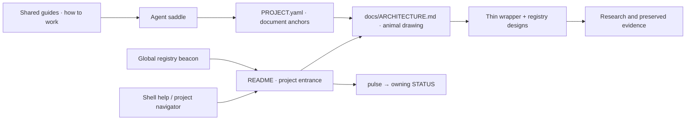

# Project documentation placement — proposal for Oraculum

`2026-10-04 · Cartan · office hruzam-120922 · nablarva core @ 18ff6f4`
`DRAFT — majkee's requested direction + Cartan's recommendation; no new gavel or implementation`

## Recommendation

**Keep the animal's description in its project, and make the existing doors lead to it.**
Use `README.md` as the human entrance, `PROJECT.yaml` as the machine-readable map,
and `docs/ARCHITECTURE.md` as the durable animal drawing. Shared guides explain methods;
the global registry and shell help provide access. Session material feeds those homes
when reviewed; it does not become the only place to discover the result.

Majkee's request is that the description be naturally reachable by the human, shell,
agents and collaborating projects, with updates reported to the right owner. The
placement and update scheme below is Cartan's proposal, submitted for Oraculum's
challenge. It does not decide final organ code homes or authorize a deployment.

## What the current files show

- `PROJECT.yaml` already names `docs/ARCHITECTURE.md`, the project-design wrapper,
  its Convergence maintainer, and flag. We have a map to extend deliberately, not a
  reason to invent another manifest.
- `README.md` still says “PROVISORIUM”, “not a project”, and “No harness”. The
  architecture page is still a July triangulation pointer. These are misleading
  first impressions beside the current L12–L14 locks and active architecture study.
- `registry.nablarva.beacon.md` is still parked. It names the former separate
  Termbrana repository and a seven-item pending docket. No Nablarva beacon or row
  exists in reposoma's registry. **nabla-lab is a different project**; keep its row.
- `ia-sync/zsh/registries/projects.json` already resolves `nablarva` correctly and
  records the unified topology. The authored `zsh/nablarva/nablarva.zsh` still opens
  `session/flag.md`, describes pulse as the doing-state, and advertises retired
  devenv transport. This is a source-level mismatch; no live command was exercised.
- Session help already discovers `help/<scope>/HELP.md` in `runbook.py`. It reads
  and searches those files; no automatic project-document resolution is established
  by that feature. Dropping a link in help alone does not implement navigation.
- Guide publication also exists: `zsh/sync/guides.zsh` and
  `zsh/registries/config.sync.json`. Only piql.dev is currently registered. It copies
  sources with a banner; it does not rewrite links or stamp a source revision.

The missing piece is maintained connections between existing surfaces, with a named
owner for the durable fold. A larger storage system would not repair these stale doors.

## Three shapes considered

| Shape | Benefit | Cost / decision |
|---|---|---|
| Put the full description in global guides | One place to search, including without the project checkout | Moves project facts away from their contract and review evidence; risks competing authorship. Reject as the primary home. |
| Project owns the description; registry, guides and shell expose it | Fits PROJECT, the beacon convention, Convergence and current flat topology | Requires maintained pointers and explicit publication for readers without the checkout. **Recommend.** |
| Build a generated catalogue of every document and session | Rich search and inventory | More schema, discovery and lifecycle machinery before fixing the first page. Defer; later derive a small view from existing owners. |

## Concrete homes and readers

| Reader's question | Authoritative or maintained home | Access / owner |
|---|---|---|
| What animal is this, and where do I begin? | Project `README.md`, short and current | Human entrance; Convergence prepares the update for the project head. Preserve displaced historical text in history/evidence. |
| How do its organs connect? | `docs/ARCHITECTURE.md` | Existing PROJECT anchor. While session 03 is open: name draft status and link its blueprint. After review/gavel: fold the surviving drawing and boundaries here. |
| What is still being designed? | `.dev/session/AGENTS.PROJECT-DESIGN.md` and linked registry designs | Convergence maintains the thin wrapper; design authors keep detailed questions in DESIGN/HYPOTHESES. Avoid reproducing the whole drawing. |
| What is settled, and what is happening now? | Flag; pulse → the relevant STATUS | Majkee locks; each head owns its gate. README, help, journal and beacon do not acquire another `next`. |
| Where are source material and research? | `meshup/REGISTRY.md`, its design sources, `raw.nablarva/`, `.dev/research/` | Project evidence stays traceable. The drawing links here when a reader needs justification. |
| How does a sibling find Nablarva? | `reposoma/registry/nablarva.md` + existing index | Thin project-relative pointers, host/updated provenance, physical resolution through the existing machine map. Refresh the parked candidate before depositing it. |
| How do I operate it from the shell? | Help beside the authored engine in `ia-sync/zsh/`; canonical project links | Shell owner maintains command truth; reviewed deploy carries code/help to `~/.config/zsh/`. Project architecture is not copied into the zsh engine. |
| What is the general session/guide/harness procedure? | Existing `reposoma/raw.guides/<topic>/GUIDE.md` and native skill/agent entry points | Shared guide owner maintains the method. Harness entry points point to project facts and shared law. No new project-manager persona is needed. |
| How can a reader without the checkout read an operator guide? | Selected project-authored guide → explicitly published read-only mirror | Use the existing guide-publishing convention after checking its tool. The mirror must retain source and revision, and have usable links. |

The animal drawing should begin with a small relationship picture and a few sentences
about purpose, organs, boundaries and what remains open. Installation trees and method
detail can follow links. The natural first encounter is README → drawing, including
when a global or shell entry brought the reader to the project.

This is a documentation-navigation proposal, not a lock on runtime architecture.

### Zsh delivery does not decide the animal's home

Journal 10-01 §1.0 Q1 asks “real app or zsh animal via ia-sync?”. The current
Convergence role already permits incremental zsh bricks while keeping project design
in Nablarva. Those can coexist. Session 03 must still settle its architecture proposal
and final organ placement; a documentation choice should not decide that indirectly.

First repair the existing `nab` locators/help in an ia-sync-owned change, and expose
the project entrance through the existing help/navigation mechanism. Do not add a
parallel path registry: `projects.json` owns physical roots; PROJECT owns relative
document anchors. A resolver should report “checkout unavailable” clearly.

For checkout-free reading, publish only a useful operator guide, not the live STATUS
or the entire experimental bed. The existing publisher is a starting point, not a
verified solution: it hardcodes `/guides/` in provenance, prepends its banner before
any YAML frontmatter, and leaves relative links unchanged. Registering `docs/` under
its current schema could mislabel provenance. Resolve these constraints under that
owner before enrollment; do not silently invent a second publisher.

## Update and reporting contract — proposed addition to the session fold

**The head that changes meaning owes the fold; Convergence owns coherent project
presentation.** A reviewer verifies it. A global agent or an automatic job does not
become the author of canon merely because it can edit all the files.

| What changed | Where its receipt and surviving meaning go |
|---|---|
| Task result / evidence | Named RETURN or VERDICT; owning STATUS records the next step and gate effect. |
| Durable project description | Appropriate project document; Convergence reconciles the wrapper and drawing. |
| Settled decision | Append to flag after majkee's gavel; do not infer a lock from a successful check. |
| Shell behavior, wiring or deployment | Ia-sync owner records source revision, deployed revision and observed behavior in its own task evidence; required substrate history goes to `journal.host-cleanup.md`. |
| Shared procedure | Proposed change goes to the existing guide's owner; project receipts link it. No full procedure pasted into every RUNBOOK. |
| Discovery anchors changed | Refresh beacon/PROJECT/help pointers as applicable. No new global registry row for each session. |
| Operator's journal fold | Short receipt under the relevant chapter: result, evidence link, unresolved handoff and owner. It summarizes; STATUS remains the queue. |

At review or session closure, ask one concrete question: **what changed that must
still be findable after this bed disappears?** The answer names the durable destination
and the entry point linking to it. “Nothing survives” is valid for a discarded probe.
Ordinary updates need no new RUNBOOK; add a general fold clause only through the guide
owner, then have future RUNBOOKs point to it.

### Preservation and findability are separate checks

Journal 10-01 §1.0 Q2 asks why deleting cleanup-00 was a good idea. The runbook guide's
existing closure rule is **promote survivors, remove the router row, then prune**.
Pruning removes obsolete task state; it is useful after the result has a visible home.
A preservation commit makes a file recoverable, but a reader still needs a route to it.
The user's missing-folder experience is evidence that recovery alone did not satisfy
that need. The prior cleanup evidence is recoverable at preservation commit `79000eb`;
`38ebfb3` removed the bed. Do not resurrect its closed doing-state merely to make the
evidence easier to browse.

Proposal: before pruning, verify the surviving result/evidence and its link from the
project's durable index. Where history is the evidence home, include the exact
commit/path and a usable recovery instruction in that index. If this cannot be done,
leave the bed pending closure. Historical flags remain append-only; the parked 1.6
archive policy is a separate decision. Field's archive audit supplies candidates,
not permission to remove locks.

## Small automation, after the placement is accepted

1. **Read-only check first.** Validate declared document links, PROJECT anchors,
   pulse/STATUS gate correspondence, registry source paths/counts, and structured
   HYPOTHESES. Report missing targets and their owners. Exclude sealed/private
   surfaces; do not crawl the entire home directory.
2. **Derived navigation next.** Generate a disposable view from PROJECT, the global
   beacon/map and guide frontmatter. Current `/guide` already derives its listing;
   keep that property. Generated rows carry source and revision and are never a
   second hand-maintained catalogue. Use explicit mappings for deliberate archives.
3. **Run it at review/fold.** Produce a reviewable diff and validation receipt.
   Publication uses the existing owner and deployment boundary. Later a preflight
   may call the check; avoid an invisible hook that commits, publishes, prunes or
   rewrites another head's STATUS.

Mechanical checks can verify paths and schemas. They cannot decide whether a summary
preserves meaning or whether a gate is closed. Start with a named manual check in the
existing workflow; choose a command name only after the required duplication sweep.

## Journal debt audit — all ten files, 2026-09-16 through 2026-10-03

Read every file under `reposoma/.majkee/journal/`, then checked relevant current
artifacts. Older “next” statements are historical observations, not automatically
current obligations. This table is a dated reconciliation for Oraculum, not another
live task queue. Unrelated device, document-conversion and personal matters were not
imported into Nablarva's plan.

| Item and journal source | Current evidence / disposition | Owning next step |
|---|---|---|
| Fold receipts 1.1–1.5, 10-01 | RETURN 04 has FAILs in provenance/receipt precision, pointers and exact X0 inventory; core data/schema checks pass | Oraculum/Delta correct the bounded findings; Cartan re-audits their concrete revision. |
| Convergence + architecture POINT 03, 10-01 §1.5 | Completed here; RETURN 03, revised candidate and router row | Existing Flight POINT 02 remains unanswered; its RETURN path is absent. Carry the amended POINT, then Cartan verifies. |
| App vs shell and disappearing session, 10-01 §1.0 | Answered as proposals above; final organ homes still open | Oraculum challenges documentation placement; architecture 03 retains its own gate. |
| Relay research launch / blind triangle, 10-01 rulings and seam h11/h12 | L14 requires research; `.dev/session/relay-00-research/` is absent; registry inputs exist | Majkee/Oraculum decide the research launch and obtain the missing independent responses. Do not imply the gate has run. |
| Event vocabulary and jev envelope, 10-01 §1.2/1.2c | Docket 8 remains pending. X0 POINT 02 is addressed to Cartan in the separate ia-sync Jev bed | That head evaluates convergence. Its Flight review **already exists, REVISE**; STATUS still says wake Flight. Verify/fold it there before implementation. |
| Multiplexer loop 1.4, 10-01 §1.5 | Adopted plan is indexed in the lab with the tmux-first adapter direction | Documentation fold exists; no new multiplexer implementation debt is silently assigned here. |
| Phone UI packet, 10-01 §1.5 | Bundle exists; `.dev/session/stridularium-00-design/` is absent; terminal-vs-cards question retained | Majkee's app draft / receiving design head. Do not manufacture a session gate. |
| Archive rule 1.6, 10-01 §1.1/1.5 | Still parked; Field's 10-04 candidate audit now exists | Oraculum reconciles candidates and seeks any needed lock change. Architecture's missing router row was repaired here; other rows/locks were preserved. |
| Muticula and publish-gate, 09-25/27/29 | Both current STATUS files show r3 and POINT 03; their named Cartan replies are absent | Their existing heads/Cartan seats own those reviews. Do not restart old B0 or r1/r2 tasks from journal wording. |
| Germline, 09-25/27 and 10-03 §1 | Atlas's STATUS still awaits two fresh-session receipts | Atlas/majkee reconcile that gate. The 10-03 file-shape journal chapter expressly does not close it. |
| Shuttle / Protocol-1 fork, 10-03 §2 | Packet and contributor RETURN exist in ia-sync; named bed has no RUNBOOK/STATUS yet | cSharp-tunnel/Cartan owns the draft-to-gate transition, head-mode decision and review. No implementation or promotion inferred from the journal. |
| Cross-vendor journal skill, 09-16; global discovery/index work, 09-25 | Earlier separate requests/parked work; this audit did not establish later closure | Ask those owners to reconcile if resumed. They are not prerequisites for repairing Nablarva's existing doors. |

There are relevant outstanding handoffs, but the journals do **not** justify opening
every old checkbox as work in this sitting. The material local debts are the audit
repairs, independent architecture challenge, research/phone handoffs, and the still
parked archive decision. Cross-project reviews keep their own ownership.

## Concrete proposal to carry

First approve the placement principle and have Oraculum review these boundaries.
Then prepare a small documentation change: refresh README and the existing architecture
entry, reconcile/deposit the beacon, and repair shell locators under the ia-sync owner.
Add a read-only navigation check once these entry points are truthful. Defer a generated
catalogue and checkout-free publication until a concrete reader requires them.

For the existing journal chapter, a proposed append-only receipt is:

> Cartan returned X0 audit 04 with bounded FAILs; folded POINT 03 into the project
> wrapper and architecture candidate, preserving the gate and Flight challenge;
> read the ten journal files and prepared the documentation-placement proposal.
> Oraculum owns receipt/pointer repairs and review of the proposal; the architecture
> head awaits Flight RETURN 02. Evidence: X0 RETURNs 03/04 and this research file.

This receipt was **not** written into the external journal. No shared guide, beacon,
shell source, live runtime, contract or lock was changed by the proposal.

## Governing sources and checks

- `nablarva/PROJECT.yaml` docs; `.germline/agents/convergence.md` Remit, Interim
  delivery route and Grey belt; flag L9′/L12/L13/L14.
- `reposoma/temple/decisions/0004-cross-project-registry.md`, L1–L6;
  `reposoma/registry/README.md`.
- `reposoma/raw.guides/guide-writing/GUIDE.md`: single surface, derived listing,
  grandfathered project-published mirrors; `raw.guides/guide-publishing.md`:
  project owns source, one-way publication.
- `reposoma/raw.guides/runbook/GUIDE.md`, On gate closure;
  `raw.guides/status/GUIDE.md`, sole doing-state and the durability boundary.
- `ia-sync/zsh/registries/projects.json`, `zsh/session/runbook.py` help discovery,
  `zsh/sync/guides.zsh`, `zsh/registries/config.sync.json`, `deploy.sh` zsh leg.

Sources were inspected, not sourced or executed. No publisher, shell alias, deploy,
runtime probe, external write, commit or push was run. Review of source behavior is
not proof of installed behavior. This is the requested proposal for Oraculum.
