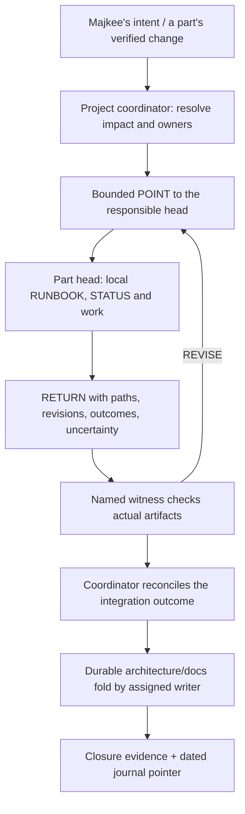

# Project coordination as the scripts grow — proposal to Oraculum

`2026-10-04 · Cartan · Codex · office hruzam-120922`
`DRAFT requested by majkee; role/process proposal, not an activated coordinator or a new lock`

Continues [documentation placement](research.cartan.documentation-placement.2026-10-04.md).
Majkee has carried that earlier proposal to Oraculum. This continuation adds the
responsibility the first proposal left under-specified: **who keeps the growing parts
coherent, commissions missing work, and checks that the description matches reality?**

**Re-entry note, 2026-10-05:** during the journal-access pause, other work advanced
HEAD to `ccfb514`, after `fd66470` preserved the earlier Cartan fold. The later commit
repairs the audited navigation/provenance wording and adds L15: no `.dev/archive/`,
superseded flag items stay in place with an Archived index; archive reconciliation
is ad hoc. The proposal uses that current boundary. Its October 4 source/live receipt
below remains dated evidence. This re-entry check is not a new nine-claim audit.

## The proposed arrangement

Test **one project architect carrying the coordination responsibility** in a finite
integration pilot, using the existing cSharp head posture. If the pilot earns its
keep, propose a standing duty recorded in project instructions, with durable
architecture carrying its continuity. Each later integration cycle still has an
observable outcome. The coordinator follows changes from an organ's intent through
its source, wiring, deployment and observed behavior, and routes discrepancies to
the responsible head. Defer the standing mandate until the pilot is reviewed.

Each part keeps its own cSharp head, RUNBOOK, gate and STATUS. Convergence maintains
the project-design wrapper. Independent reviewers test claims. Majkee keeps the
architectural gavel. Oraculum is a natural candidate to carry the project-coordination
duty if majkee assigns it; Cartan can continue the existing architecture/Convergence
work. This document assigns neither seat a new mandate.

Three possibilities were considered:

| Arrangement | Assessment |
|---|---|
| Extend Convergence from wrapper upkeep to all project coordination | Small-looking change, large hidden authority expansion. Its current remit explicitly limits writes to the wrapper. |
| Trial the duty with an existing project architect; use a bounded integration cycle and part heads | **Recommended.** Reuses current roles and protocol; a standing mandate follows only after the trial earns it. |
| Install a permanent supervisor that watches all scripts and dispatches work | A possible later mechanism. Today it would require unchosen discovery, permissions, transport and recovery behavior. |

The important addition is an accountable duty and review loop. A new agent name or
continuously running process does not establish either by itself. The proposed duty
can be rendered through existing runtime roles; the Codex `architect` subagent is
read-only advice, while the main controller remains the integration owner.

## Boundaries: whole animal, independent parts

| Responsibility | Owner and limit |
|---|---|
| Purpose, relationships, interfaces, architectural consistency | Project coordinator proposes and maintains the overall view; majkee locks consequential choices. |
| A bounded organ/brick change | Its part head owns the local RUNBOOK/STATUS, implementation assignments and recovery. |
| Project-design wrapper | Convergence, within its existing target. README or architecture-page work needs an explicit bounded assignment to their writer; it is not silently added to Convergence's remit. |
| Ia-sync source, shared wiring and deployment | The receiving ia-sync head under that repository's scope. Nablarva sends a request/evidence need, not an instruction to bypass that owner. |
| Independent claim checking | A named witness; verified artifacts and limits go into the receiving head's decision. |
| Cross-project priorities or conflicting ownership | The coordinator surfaces the collision to majkee and the affected owners. It does not acquire authority over every script on the computer. |

Start with the Nablarva organs and their declared shared dependencies. Work outside
that boundary enters through an identified owner and an accepted request. A new
unowned script is an ownership question before it becomes a silently adopted organ.
Existing authorized local work can continue without passing every edit through the
coordinator; involve it when a shared boundary, dependency, placement or user promise changes.

For a shared file such as `session/base.zsh` or `keyboard.zsh`, establish one writer
and an edit order before dispatch. Separate part gates do not make overlapping file
ownership safe. Other heads return their required delta to that shared-seam owner.

## The overview that survives sessions

Keep the animal drawing at the already-declared `docs/ARCHITECTURE.md` anchor.
Under it, maintain a compact map of responsibilities to their implementation homes:
organ/capability → responsible owner → source entry → wiring/help → related contract.
This is a standing architecture map, not a list of workers' next actions. Detailed
research stays in the registry designs; physical project roots stay in the existing
ia-sync project registry. No second global path catalogue is proposed.

Alongside a particular review, take a **dated evidence snapshot**: source revision,
deployed bytes/revision on each relevant host, and the behavior actually exercised.
Link that receipt from the overview when useful. A newer source change makes the old
receipt historical; it must not silently make the deployment or behavior claim newer.

Current examples for the standing map (a dated observation, not a new assignment):

| Capability | Authored source | Wiring / operator surface | Current work owner |
|---|---|---|---|
| Ovitmugen frame and agent tabs | `ia-sync/zsh/session/ovitmugen.py` + `.zsh` | `session/base.zsh`, `keyboard.zsh`, `help/ovitmugen/HELP.md` | Trajectory; Nablarva `ovitmugen-01-basement/STATUS.md`. That session forbids deployment. |
| Session and evidence browser | `ia-sync/zsh/session/runbook.py` + `.zsh` | Same session wiring; dynamically discovered help scopes | Trajectory owns the tool; `runbook-tool-01-coordination` is a separately gated successor pilot. |
| Nablarva entry and document shortcuts | `ia-sync/zsh/nablarva/nablarva.zsh` | `base.zsh`, `keyboard.zsh`, host config | Repair owner not identified in the bounded read; an ia-sync owner must accept that scope. |

The coordinator must distinguish four questions:

1. **Intended:** what do the current locks, contract and accepted design say?
2. **Authored:** what do the engine, aliases, help and configuration actually contain?
3. **Installed:** which of those bytes and bindings are present on the named host?
4. **Exercised:** what did a specified scenario demonstrate there, and when?

Agreement at one level does not prove the next. An audit can conclude “source matches;
installation unverified” without either manufacturing PASS or treating unknown as a defect.

## One coordination cycle

1. At a requested review, a significant part change or re-entry, read the project
   anchors and the affected owners' STATUS files. Identify the concrete mismatch or
   missing decision; do not scan private histories or the whole home directory.
2. State the integration outcome, affected owners, allowed files and evidence needed.
   If an existing gate already owns the work, route to it. Open a new session only
   for a distinct bounded outcome; do not create an endless “keep everything tidy” gate.
3. Write a POINT with exact read/write scope, exclusions, completion condition and
   RETURN path. The receiving head accepts it within its own gate or reports the
   mismatch. It decides its local work sequence and worker delegation.
4. Carry the file through an authorized route. Today an operator can carry its exact
   path. File creation, carriage, reading, execution and acceptance are distinct facts.
   This proposal does not enable a tunnel, watcher or terminal input mechanism.
5. Verify the RETURN against its cited artifacts. An independent witness checks
   consequential changes; the owning head records the VERDICT and STATUS transition.
   A correction after handoff is a new cycle, not an edit to somebody else's receipt.
   Under cSharp, bodies of implementation and documentation work are delegated whole;
   the head navigates and verifies. Name a standing witness for the head's own STATUS
   claims at authoring, rather than allowing the head to confirm its own gate.
6. Check the integration outcome across the affected parts. A local test PASS may
   leave the integration outcome blocked by another part or by missing host evidence.
7. Assign the durable documentation fold, verify its links, then close the bounded
   integration work when its declared gate permits. Before pruning, the cSharp's
   promotion manifest accounts for every raw keeper and its experience transfer
   carries the lessons to the successor. The journal gets the result and
   re-entry pointer; it does not take over anyone's `next:`.

The coordinator's STATUS contains only its own integration obligations and next
verification. Each part's STATUS remains authoritative for that part. The project
pulse remains a router. If the pilot earns a standing coordination responsibility,
it will persist through the approved role and durable architecture, not a permanent
session directory or a second project pulse.

For two or more full CLI seats working under **one integration gate**, reuse the
existing `runbook/res/fanout-turns.md`: POINT/RETURN/VERDICT cycles, one open turn,
`delegated`, one `join_when`, and one `next`. Native subagents are a different
delegation mechanism. Independently owned project gates are not converted into
subordinate seats by writing a fan-out row; their heads must accept the handoff,
with one exact receipt home agreed before work. Avoid mirrored mutable bus files.

## Worked situation A — the project launcher points to the old animal

**Observed starting point:** flag L9′ makes pulse a router to STATUS; L12 puts the
project in one repository. `projects.json` records that topology. Yet the authored
`zsh/nablarva/nablarva.zsh` still opens `session/flag.md`, `session/pulse.md` and
`session/dock.md`, and offers the retired devenv sync/deploy route. Its keyboard/help
also describe the former arrangement. This is a concrete candidate for coordination.

**Additional static check on office:** all three Nablarva engine/base/keyboard files
are byte-identical between authored source and `~/.config/zsh/nablarva/`. The old
three document targets and `nablarva.devenv/` are absent. Source and live host config
still name the old devenv location; the config comments already flag the deferred
repair. This establishes a mismatch in installed files as well as source. No alias
was invoked, so it does not attest to functions loaded in an existing shell process.

**Hypothetical next cycle, not work executed by this proposal:**

- Coordinator frames the user outcome: the existing `nab` entry takes majkee to
  current project anchors and describes the real delivery topology.
- Ia-sync's receiving head owns the bounded engine/keyboard/help change. It establishes
  the before-state, declares how retired transport verbs behave, and returns a diff
  plus focused checks. The task does not receive blanket permission to deploy the table.
- A separate documentation assignment repairs the project entrance and beacon, using
  the same current anchors. Two writers may work in parallel on disjoint files.
- The witness checks the paths and callable behavior. Source approval can complete
  first; a deployment receipt and fresh-shell observation are separate evidence.
- The integration head compares the resulting source, help and project map. If the
  source is corrected but the office shell still has the old function loaded, the
  accurate result is “source corrected; live behavior still unverified/old”, with
  the remaining action in the owning deployment task.
- After the declared outcome is verified, the durable docs and journal point to the
  evidence. A future reader can find the current entrance without opening this cycle.

This example also prevents a common mistake: correcting the documentation to describe
obsolete code would conceal the discrepancy with L12. Compare all three descriptions
before choosing which one should change.

## Worked situation B — a useful brick grows across an organ boundary

Suppose an Ovitmugen change adds an operator interaction that another organ also wants
to bind, or proposes to move its state home. This is an illustrative change, not a
claim that a new conflicting feature has been implemented.

An existing boundary already demands this behavior: Ovitmugen's RUNBOOK lines 86–94
preserve the public `ov-ls --json` shape, require its proposed state directory to reach
session 03 before B1 writes it, and forbid deployment by that session.

The part head first identifies the shared keyboard or data-home contract and sends
the coordinator the exact proposed difference. The coordinator checks neighboring
owners and the architecture; routine local details stay with the part. An unresolved
ownership or state-home choice returns to the relevant architecture gate/majkee,
while independent local work can proceed within its existing authorization.

After the decision, each affected head changes its own source and help. The witness
checks both individual behavior and the combination: preserved public output, no
key collision, the declared state home, and source/installed/observed evidence for
the relevant hosts. A whole-table deployment might include unrelated committed
bricks, so the ia-sync owner must account for its actual scope. The project coordinator
cannot grant a narrower deployment by merely naming a single organ in its request.

## Making it lighter rather than adding another meeting

**Reuse the existing tool pilot.** Ia-sync already has
`runbook-tool-01-coordination/RUNBOOK.md`: an attention view, economical helpers and
entry-card assessment under `cartan-coordination`, with Trajectory as tool owner and
Oraculum as independent witness. Its STATUS records planning only, parked behind
identity-resolution evidence. This sitting has not requalified that dependency.
It is a potential instrument for this project's coordinator, not a mandate to own
Nablarva's architecture. Route attention-view requirements to that owner; do not
open a rival scanner, roster experiment or pilot under this proposal.

That tool pilot dispatches only its own approved work. It does not dispatch Nablarva
part work or rewrite those heads' STATUS files. Conversely, the proposed integration
head consumes tool findings without taking over its implementation or prerequisites.
Track each accepted request in one owning gate, with external evidence pointers
where needed; never issue the same task from both coordination heads. Ordinary
manual project reconciliation does not inherit the tool pilot's identity dependency.

Begin with existing files and a manually invoked review. The coordinator produces
one bounded request per independent owner, reads one evidence-bearing return, and
routes only the unresolved choices to majkee. It does not demand a status meeting
or a new document for each implementation step.

Later automation can derive navigation, check registered paths and schemas, compare
source/deployed hashes, and identify receipts newer than an owning STATUS snapshot.
It should report findings for an owner to reconcile. Semantic architecture review,
acceptance, deployment authorization and closure remain explicit transitions.

Existing carriage work, including the separate shuttle/tunnel proposal, can supply
transport later if its owner qualifies it. Reuse that boundary; do not build another
messenger as a side effect of this coordination proposal.

## Proposed pilot and the choices for Oraculum

Pilot one finite reconciliation: the Nablarva launcher/documentation mismatch above.
First prepare its agreed ownership and before-state map. After the receiving owners
accept the bounded tasks, carry them through the existing file route, verify their
returns, and fold the surviving description. This is a proposed pilot, not a launch.

Success: one cold reader reaches the current project anchors; one cross-part mismatch
is resolved through the right owners; each declared implementation/deployment claim
has scoped evidence; no task has two authorities for its next action. Compare the
operator's carriage and re-entry effort before and after. Reconsider the process if
the coordination overhead exceeds the confusion it removes.

The hardest case is two parts changing shared wiring while both pass isolated tests.
The integration witness must inspect the combined load order and exercise the chosen
workflow. A rollback also needs the actual live cleanup route: additive deployment
can leave a retired engine behind. Source reversion alone does not prove live removal.
Any cleanup remains the deployment owner's bounded operation.

Oraculum should challenge three decisions before a mandate is drafted:

1. Who carries the project-coordination duty, and which project/dependency boundary
   does majkee assign? Recommended starting scope: Nablarva plus named ia-sync seams.
2. Which existing gate can own the pilot's integration outcome, or does it need a
   new finite gate? Session 03 remains an architecture study; it does not authorize
   a shell repair merely by being nearby.
3. Which discrepancies must return for a decision, and which routine reconciliations
   can heads carry through under standing authorization? Avoid making majkee approve
   every file relay or harmless local correction.

The proposed mandate, any runtime rendering, and a recurring automation mechanism are
later reviewable changes. This sitting prepares the process and journal fold only.

## Evidence anchors

- Nablarva `AGENTS.md`, role routing; flag L6/L9′/L12–L14; `PROJECT.yaml`, docs;
  `.germline/agents/convergence.md`, Remit and Grey belt.
- `.dev/session/nablarva-03-app-architecture/RUNBOOK.md`, gate and ownership.
- `.dev/session/ovitmugen-01-basement/RUNBOOK.md:86` and STATUS, public output,
  architecture handoff, and deployment hold.
- `ia-sync/zsh/nablarva/{nablarva,keyboard}.zsh` and
  `ia-sync/zsh/registries/projects.json`, current authored topology descriptions.
- `reposoma/raw.guides/bus/GUIDE.md`, bounded assignment, single writer, verification;
  `raw.guides/runbook/res/csharp-head-protocol.md`, head posture, standing witness,
  promotion manifest and experience transfer;
  `raw.guides/runbook/res/fanout-turns.md`, full-session turns;
  `raw.guides/status/GUIDE.md`, one present position per gate.
- `reposoma/.majkee/{AGENTS.md,README.md}`, append-only own chapter and day-square
  pointers; `codex-harness/references/cross-runtime-roles.md`, shared roles and
  runtime-specific implementation.

### Static receipt for the launcher example

Read-only Python byte comparisons of `~/ia-sync/zsh/nablarva/<file>` against
`~/.config/zsh/nablarva/<file>` on office, 2026-10-04:

| File | Both copies SHA-256 |
|---|---|
| base.zsh | `0b587fe38ddb1e777822eafa1e83d2d7c74e6672929441cc8ba7bed9ce7dd80a` |
| keyboard.zsh | `9d3c654a692acbfd85dd2d591ddf2f487cbf5736f5767d38c6c6c9c4778665cc` |
| nablarva.zsh | `23b6fef41613d66f2ea020ca944d023ca996fdb98831361c60b152c79f3967ce` |

`Path.exists()` returned false for each old `nablarva/session/{flag,pulse,dock}.md`
and for `~/unikuklatrix/nablarva.devenv`. The current `.dev/session/` counterparts
were read. This receipt establishes filesystem state only; no home-host or live
command behavior claim follows from it.

### Proposal review

Read-only architect and explorer returns informed the authority map and concrete
examples; Cartan checked the controlling role/protocol files, launcher source,
Ovitmugen constraints, existing tool pilot and launcher byte comparisons directly.
An independent challenger returned **REVISE**: an immediate standing coordinator
could become a second dispatcher beside the existing pilot. This revision defers
the standing mandate, starts with one finite integration gate, and makes the two
heads' dispatch boundaries explicit. A bounded follow-up returned **PROCEED** on
that risk and requested one remaining pilot-tense correction; that wording is now
fixed. This is proposal review, not runtime qualification or majkee's acceptance.
