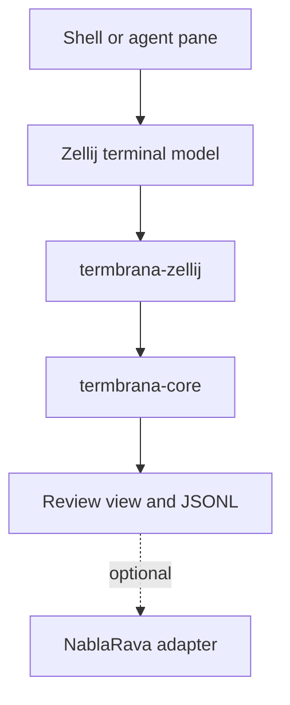

`source: ~/.remote/harvest · author: Wave r0 2026-08-15 · adopted: flag L11 2026-08-15 · role: founding canon`

# Termbrana — Project Definition

**Status:** Draft r0  
**Date:** 2026-08-15  
**Decision owner:** majkee  
**Source lineage:** Nabla's Foil exploration, revised by Wave  

---

## 1. Definition

> **Termbrana is an independent semantic observation, navigation, and replay layer for terminal sessions.**

It turns visually linear terminal history into inspectable blocks without requiring the underlying shell, agent, or orchestrator to become an editor.

Termbrana is initially implemented as a Zellij plugin plus a pure core library. NablaRava may consume its neutral output through an optional adapter, but Termbrana must remain fully useful without NablaRava.

### The user problem

A terminal offers streams, search, selection, and scrollback. It generally does not provide durable semantic units such as:

- this prompt and its answer;
- this tool execution and its output;
- this approval request;
- this error and its related context;
- this test run;
- this block has not been reviewed yet;
- return to the block I marked earlier.

Editors solve related navigation problems after content becomes a file. Termbrana provides a smaller read-oriented structure while the content is still a terminal session.

---

## 2. Product laws

### 2.1 Truth and projection are separate

An observation is retained with its provenance. Highlights, blocks, filters, summaries, and visual washes are derived projections and cannot silently replace their source.

### 2.2 Sequence is authoritative

Every retained record has a monotonic sequence number. Wall-clock time is useful metadata but is not required for deterministic ordering.

### 2.3 Standalone first

`termbrana-core` contains no NablaRava or vendor-agent concepts. Integrations translate at the edge.

### 2.4 Read-only first

The default product observes and navigates. Sending characters, signals, or commands into another pane requires a separately enabled operator capability.

### 2.5 Native facilities outrank replicas

Use Zellij's search, scrollback editor, pane lifecycle, regex highlights, clicks, and display model when they satisfy the need. Termbrana owns only the semantic layer that the host does not supply.

### 2.6 No false security claims

A post-render Zellij plugin does not own raw PTY bytes and is not a pre-parser sanitizer. Provenance labels must make this limitation visible to users and downstream systems.

### 2.7 Retained history is append-only

Corrections produce new records or new derived projections. Termbrana does not silently rewrite a retained observation.

---

## 3. Initial system boundary



Zellij owns terminal parsing. Termbrana observes Zellij's result, derives semantic structure, renders a review surface, and can persist neutral records.

### Components

| Component | Owns | Explicitly does not own |
| --- | --- | --- |
| `termbrana-core` | model, index, navigation, filters, replay | Zellij calls, PTYs, NablaRava rooms |
| `termbrana-zellij` | host compatibility, pane observation, UI, highlights | raw-byte authority, orchestration reasoning |
| `termbrana-log` module | JSONL encode/decode and retention policy | classification policy |
| `termbrana-nablarava` | translation into NablaRava boundary messages | Termbrana core behavior |
| future `termbrana-pty` | raw PTY transport and control policy | first-release user interface |

Avoid splitting `termbrana-log` into a separate crate until a second consumer makes that useful.

---

## 4. Domain model

### Observation

An immutable retained input from a known source grade.

Required identity:

- Termbrana schema version;
- monotonic sequence;
- session identity;
- pane identity;
- source grade;
- event kind;
- payload.

Optional identity:

- wall-clock timestamp;
- host version;
- adapter version;
- correlation identifiers supplied by an integration.

### Source grade

One of:

- `raw_pty` — future PTY owner only;
- `rendered_ansi` — host-rendered representation retaining ANSI styling;
- `rendered_text` — host-rendered plain text;
- `derived` — structure produced from another record.

### Semantic block

A derived range within retained terminal content.

Candidate kinds:

- `prompt`
- `answer`
- `command`
- `tool`
- `output`
- `error`
- `approval`
- `test`
- `note`
- `unknown`

A block records:

- stable block ID;
- parent observation sequence or sequence range;
- start and end coordinates in the retained projection;
- kind and title;
- classifier identity;
- confidence when inferred;
- explicit-marker flag.

### Bookmark

A user-owned symbolic name pointing to a block ID or retained observation position. A bookmark does not copy the block.

### View state

Ephemeral unless explicitly saved:

- live-following or frozen;
- current offset and active block;
- filters;
- collapsed blocks;
- unread cursor;
- selected pane.

---

## 5. Minimal neutral record format

Termbrana uses newline-delimited JSON for its first durable interface. Each line is independently parseable and appendable.

Illustrative observation:

```json
{"v":0,"seq":41,"session":"work-7","pane":{"kind":"terminal","id":3},"source":"rendered_text","kind":"viewport","payload":{"lines":["cargo test","test result: ok"]}}
```

Illustrative derived block:

```json
{"v":0,"seq":42,"session":"work-7","pane":{"kind":"terminal","id":3},"source":"derived","kind":"block","parent":{"seq":41},"payload":{"id":"b-41-test","block_kind":"test","title":"cargo test","start_line":0,"end_line":1,"classifier":"explicit-or-heuristic","confidence":0.91}}
```

This is a candidate envelope, not a frozen public schema. The truth spike may change field representation, but it must preserve the laws above.

### Optional explicit marker

Wrappers or cooperative agents may print a visible, searchable line:

```text
@@termbrana:block <id> <kind> <title...>
```

An optional end marker is:

```text
@@termbrana:end <id>
```

Rules:

- ASCII and grep-friendly;
- the first token identifies the protocol;
- ID and kind contain no whitespace;
- title occupies the rest of the line;
- a missing end marker ends at the next block marker or current capture boundary;
- markers improve determinism but are never required for ordinary use.

Natural headings and provider-specific output can also be indexed by profile classifiers. Profiles remain outside `termbrana-core` policy.

---

## 6. MVP user surface

### Required

- select or retarget a terminal pane;
- live-follow and freeze the review view;
- index explicit and generic semantic blocks;
- next/previous block navigation;
- search retained text;
- create and revisit bookmarks;
- copy the active block;
- filter to at least errors, commands/tools, and all blocks;
- display provenance grade and capture freshness;
- survive target-pane closure without trapping input;
- operate without NablaRava.

### Valuable immediately after MVP

- next unread block;
- collapse long outputs;
- clickable URLs and `path:line` targets;
- user-defined regex block rules;
- export the active block or session range;
- compare two command or test blocks;
- provider profiles for Codex, Claude, Gemini, and generic shells;
- optional NablaRava projection.

### Parked

- continuous per-cell opacity;
- a general-purpose terminal emulator;
- raw PTY audit claims;
- pre-parser escape sanitization;
- opaque binary history formats;
- autonomous command injection;
- provider-specific logic inside the core;
- a central daemon before more than one real consumer needs it.

---

## 7. Capability modes

### Observer mode — default

Required capability: read pane contents and normal input while the plugin pane is focused.

Provides navigation, blocks, bookmarks, filters, highlights, export, and replay.

### Operator mode — optional

Additional capabilities may include writing to a pane, sending a signal, or temporarily intercepting input.

Operator mode must be:

- explicitly enabled;
- visibly indicated;
- separately permissioned;
- fail-closed;
- escapable with `Esc`;
- tested so unhandled keys are never lost.

The MVP does not require operator mode.

---

## 8. Independence contract with NablaRava

Termbrana may know that it can emit or receive neutral messages. It does not know NablaRava room topology, budgets, agent identities, routing, or reasoning policy.

The adapter may:

- forward a selected block;
- announce a new error or approval block;
- attach Termbrana provenance to a NablaRava record;
- receive a request to focus or export a block.

The adapter may not:

- relabel rendered text as raw capture;
- mutate Termbrana history;
- make Termbrana startup depend on NablaRava availability;
- place NablaRava-specific fields into the core schema without an extension namespace.

This makes Termbrana independently installable, testable, and useful while remaining a strong sensor for NablaRava.

---

## 9. Naming

**Product:** Termbrana  
**Meaning:** terminal + membrane; a selective boundary between terminal streams, semantic projections, users, and optional orchestrators.  

Candidate technical names:

- repository: `termbrana`
- core crate: `termbrana-core`
- Zellij crate/artifact: `termbrana-zellij`
- optional binary later: `termbrana-pty`
- optional adapter: `termbrana-nablarava`

No public package or domain availability is asserted by this document.

---

## 10. Success criterion

Termbrana earns existence when a user can return to a meaningful terminal event faster and more reliably than with raw scrollback search, while retaining a neutral inspectable record usable outside NablaRava.

Visual novelty alone is not success.
